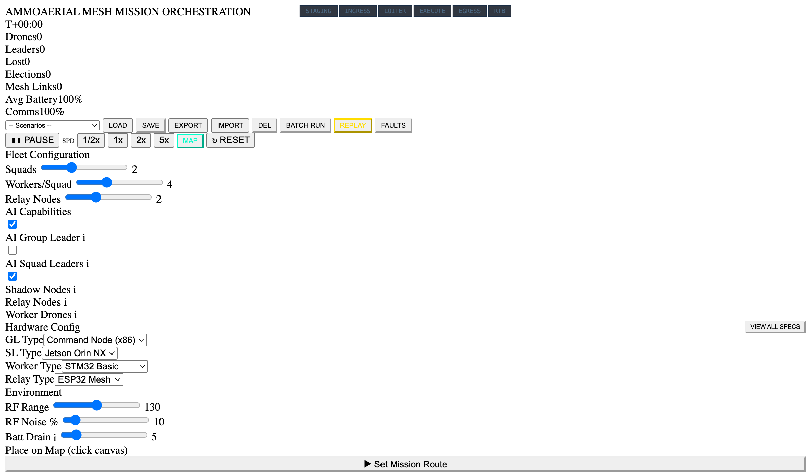

# AMMO — Aerial Mesh Mission Orchestration

> Autonomous drone swarm simulation platform for testing hierarchical mesh protocols, leader election algorithms, and fleet survivability under contested RF environments.

[](LICENSE)
[](package.json)
[](https://shurikm.github.io/ammo/)
[](#tech-stack)
[](#tech-stack)

<p align="center">
  
</p>

## What is AMMO?

AMMO is a **digital twin simulation platform** for autonomous drone swarms. It models realistic mesh networking with a hierarchical leadership structure (GL -> SL -> Workers), autonomous decision-making with AI-enabled nodes across 5 capability tiers, sub-second leader election via shadow node failover, and adversarial conditions including RF jamming, GPS denial, and directed energy weapons. Every drone carries hardware-accurate specs — from a 64 GB Jetson AGX Orin running local transformers down to a 520 KB ESP32 acting as a pure mesh relay — and the simulation faithfully models how each platform drains battery, propagates RF, and responds to threats.

The platform answers questions that matter for real swarm deployments: *"What hardware mix survives 60% node loss?"*, *"How fast does the mesh reconverge after leader failure?"*, *"What's the fleet survival rate under contested RF?"* AMMO provides three operational modes to find these answers: **interactive operator training** with real-time fault injection and live metrics, **batch parameter sweeps** with seeded PRNG for deterministic, reproducible research across fleet configurations, and **protocol verification** with 6 built-in assertions that continuously validate election timing, mesh connectivity, and shadow promotion compliance.

## Key Features

### Hierarchical Fleet Architecture

- **GL (Group Leader) -> SL (Squad Leaders) -> Workers** three-tier command hierarchy
- Shadow nodes with pre-loaded mission state for zero-downtime failover
- Relay nodes for mesh range extension (1.5x RF multiplier)
- 6 distinct drone roles with shape-coded, color-coded visualization

### Sub-Second Leader Election

- Candidate scoring: health x 0.5, battery threshold (+20 if >40%, -30 otherwise), shadow bonus (+40)
- Shadow nodes inherit full mission state — zero state loss on promotion
- Election recovery tracked with MTTR and p99 metrics
- Configurable AI autonomy per fleet tier (GL, SL independently toggle-able)

### 6-Phase Mission Engine

- **STAGING -> INGRESS -> LOITER -> EXECUTE -> EGRESS -> RTB** lifecycle
- Phase-dependent drone behaviors: tight formation on ingress, 90px spread during execute, return-to-origin on RTB
- Auto-transitions based on fleet position (60% workers at waypoint) and casualty thresholds (50% loss triggers egress)
- Mission completion tracking with phase timing log

### Real-Time Metrics & Analytics

- Live KPIs: MTTR, Mesh Uptime %, Fleet Survival %, Shadow Win Rate, p99 Election Recovery
- 4 Canvas 2D charts — fleet size over time, election recovery durations, battery distribution, link quality
- BFS-based mesh partition detection from GL node
- JSON export for post-analysis

### Batch Simulation Engine

- Fully headless simulation — DOM-independent, runs in pure JS
- Seeded PRNG (mulberry32) for deterministic, reproducible runs
- Parameter sweep across workers, squads, noise, battery drain, RF range
- Chunked execution (3 runs per frame) to keep UI responsive during batch

### Protocol Verification & Assertions

- 6 built-in protocol compliance checks: election speed (<2s), GL existence, low battery alerts, mesh connectivity (<10s partition), shadow win rate (>50%), fleet survival (>60%)
- Pass/Fail/Warn/Pending status board with configurable check intervals
- Deterministic replay with bidirectional timeline scrubbing (up to 3,600 snapshots)
- Fault injection scheduler with 9 action types and JSON-defined fault scripts

### Threat Library

- 5 adversarial threat types: Static AA (100px detection / 40px kill), Mobile Patrol (70px / 30px), Counter-UAS RF Detector (150px jam), Directed Energy Weapon (120px / 60px cone), Net Gun Interceptor (50px / 25px)
- RF jamming zones with 85% link quality penalty, GPS denial zones, mobile attackers
- Per-threat engagement logic with cooldown timers (3-8s) and kill zone visualization
- Real-time threat assessment logged in AI decision feed

### Geospatial Map Integration

- Leaflet/OpenStreetMap overlay toggle
- Canvas-over-map dual-layer architecture
- Pixel <-> lat/lng coordinate bridge
- Real-world terrain context for mission planning

## Architecture

```
src/
├── sim/                 Simulation engine (pure logic, no DOM dependency)
│   ├── engine.js          Main loop, state management, tick-based update
│   ├── drones.js          9 hardware types, drone factory, battery & RF physics
│   ├── election.js        Score-based leader election with shadow promotion
│   ├── protocol.js        11-state protocol state machine (IDLE → DEAD)
│   ├── metrics.js         Timeline sampling, partition detection, KPI computation
│   ├── batch.js           Headless simulation, seeded PRNG, parameter sweeps
│   ├── mission.js         6-phase mission lifecycle with auto-transitions
│   ├── comms.js           5-level comms degradation (FULL_MESH → LOST_CONTACT)
│   ├── threats.js         5 threat types with engagement behaviors
│   ├── assertions.js      Protocol compliance verification engine
│   ├── replay.js          State snapshots, deterministic playback
│   ├── faults.js          Scheduled fault injection engine
│   └── utils.js           Seeded PRNG (mulberry32), distance functions
├── render/              Visualization layer (Canvas 2D + Leaflet)
│   ├── canvas.js          Drone shapes, mesh links, zones, particles, HUD
│   ├── charts.js          4 real-time metrics charts (no chart libraries)
│   └── map.js             Leaflet integration, coordinate bridge
└── ui/                  Interface wiring
    ├── panels.js          Config panels, drone inspector, scenario I/O
    ├── modals.js          Hardware catalog, batch runner, fault scheduler
    ├── log.js             Event & AI decision logging
    └── tooltip.js         Contextual help tooltips
```

## Hardware Catalog

9 simulated drone platforms spanning the full compute spectrum:

| Platform | Class | AI Level | CPU | Airtime | RF Range | Best For |
|----------|-------|----------|-----|---------|----------|----------|
| **Command Node** | Ground / Heavy UAS | 4 — CLOUD-AI | x86-64 Core i7 + RTX 3060 | 45 min | 2.2x | Fleet orchestration, cloud ML inference |
| **Jetson AGX Orin** | Heavy Leader UAS | 3 — FULL-AI | A78AE 12-core + Ampere 2048c | 35 min | 1.7x | Autonomous mission adaptation, local transformer |
| **Jetson Orin NX** | Mid Leader UAS | 3 — FULL-AI | A78AE 8-core + Ampere 1024c | 28 min | 1.4x | Squad orchestration, compressed transformers |
| **Jetson Nano 4GB** | Light SBC UAS | 2 — EDGE-ML | A57 4-core + Maxwell 128c | 22 min | 1.1x | Object detection, MobileNet/TFLite inference |
| **RPi5 + Hailo NPU** | Light SBC UAS | 2 — EDGE-ML | A76 4-core + Hailo-8 (26 TOPS) | 25 min | 1.0x | Edge inference, basic orchestration |
| **RPi Zero 2W** | Micro Worker UAS | 1 — RULES | A53 4-core 1GHz | 18 min | 0.85x | ISR, relay — rule engine only |
| **STM32H7 Advanced** | Constrained MCU UAS | 1 — RULES | Cortex-M7 480MHz | 40 min | 0.9x | Strike, relay — sub-ms reflexes, long battery |
| **STM32F4 Basic** | Minimal MCU UAS | 0 — NONE | Cortex-M4 168MHz | 55 min | 0.75x | Relay, sensor — pure deterministic firmware |
| **ESP32 Mesh Node** | Ultra-light Relay | 0 — NONE | Xtensa LX6 240MHz | 90 min | 0.8x | Pure mesh relay — zero payload, max endurance |

## Drone Roles

| Role | Abbr | Color | Purpose | AI Capable |
|------|------|-------|---------|------------|
| Group Leader | GL | `#00d4ff` | Top-level command, fleet-wide coordination | Yes (AI Level 3-4) |
| Squad Leader | SL | `#00ffcc` | Squad command, worker task assignment | Configurable |
| Autonomous SL | ASL | `#bf7fff` | AI-enabled squad leader, autonomous adaptation | Yes |
| Worker | W | `#39ff88` | Mission execution, ISR, strike | Hardware-dependent |
| Shadow | SH | `#ff9e00` | Hot standby — mirrors leader state for instant failover | Hardware-dependent |
| Relay | RL | `#ffe033` | Mesh range extension (1.5x RF multiplier) | No |

## Physics Models

### RF Link Quality

```
maxRange = cfg.rfRange * min(hw_a.rfRangeMult * roleScale_a, hw_b.rfRangeMult * roleScale_b)
quality  = 1 - (distance / maxRange) - noise * 0.5 - jamPenalty
jamPenalty = (1 - minDistToJammer / jamRadius) * 0.85      // per jam zone
Link drops at quality < 0.04
```

Role-based RF multipliers: GL=1.6x, SL/ASL=1.3x, Worker=1.0x, Shadow=1.0x, Relay=1.5x.

### Battery Drain

```
drainPerSec = cfg.battDrain / 60           // battDrain is % per sim-minute
effective   = drainPerSec * aiMult * hw.drainMult * dt
aiMult      = 1.4  (if AI-enabled)  |  1.0  (otherwise)
hw.drainMult: Command Node=1.8x, AGX=1.5x, NX=1.3x, ESP32=0.2x, STM32F4=0.3x
```

### Leader Election Scoring

```
score = health * 0.5
      + (battery > 40% ? +20 : -30)
      + (isShadow ? +40 : 0)
Winner = max(score) among alive squad members
```

Shadow nodes score +40 bonus, ensuring pre-synchronized nodes are promoted first. Post-election, the new leader inherits full mission state and immediately assigns a new shadow from the healthiest remaining worker.

## Quick Start

```bash
git clone https://github.com/ShurikM/AMMO.git
cd AMMO
npm install
npm run dev
```

Then in the simulator:

1. **Configure fleet** — Set squad count, workers per squad, relay count, and hardware types in the Config panel
2. **Set route** — Click "Route Mode" and place waypoints on the canvas for the mission path
3. **Start mission** — Hit "Start Mission" to begin the STAGING -> INGRESS -> EXECUTE lifecycle
4. **Inject faults** — Kill leaders, drop jam zones, or load a fault script to stress-test the protocol
5. **Check metrics** — Watch live KPIs (MTTR, mesh uptime, survival %) and 4 real-time charts
6. **Run batch** — Open the Batch Runner to sweep parameters with seeded PRNG across dozens of configurations

## Tech Stack

| Technology | Purpose | Why |
|-----------|---------|-----|
| **Vanilla JavaScript** | Simulation engine + UI | No framework overhead, full control over update loop and rendering |
| **Canvas 2D** | All rendering including 4 metric charts | Custom pixel-level control — no D3, no Chart.js |
| **Leaflet.js** | Geospatial map layer | Only runtime dependency — toggleable OpenStreetMap overlay |
| **Vite** | Dev server + production build | Fast HMR, ES module bundling |

**By the numbers:**

- ~10,700 lines of JavaScript across 21 modules
- ~284 KB total production build (236 KB JS + 24 KB CSS + HTML)
- 1 runtime dependency (Leaflet)
- 0 UI frameworks

## Roadmap

### Simulation Depth

- [ ] Message bus with centralized routing and logging (HEARTBEAT, TASK_ASSIGN, INTEL_REPORT, SYNC_STATE, ELECTION_VOTE)
- [ ] Message drop simulation with configurable drop rate per link quality tier
- [ ] Topology presets: chain, ring, star, full mesh, split-brain
- [ ] Partition injection with forced graph cuts at scheduled times
- [ ] Large fleet support (100-1000 drones) with spatial indexing for link calculation
- [ ] Election cascade detection — flag when elections trigger further elections

### Verification & Analysis

- [ ] Protocol timing specs with expected durations per operation
- [ ] Timing measurement: actual vs spec comparison per operation
- [ ] Timing violation alerts when operations exceed spec
- [ ] Statistical timing reports (mean, p50, p95, p99, max) per operation type
- [ ] Reconvergence measurement: time from partition heal to full mesh restoration
- [ ] Protocol overhead metrics: messages/sec, bytes/sec vs fleet size

### Operational Realism

- [ ] Weather model: wind, precipitation, temperature affecting battery and movement
- [ ] Terrain & RF propagation: elevation grid, line-of-sight, ITU-R path loss
- [ ] Realistic LiPo discharge curve: non-linear voltage vs capacity
- [ ] Load-dependent drain: hover vs forward flight vs sensor active
- [ ] Launch/recovery pads with capacity limits and recharge cycles
- [ ] After-action review: full state recording, annotation system, branch-from-replay

## Contributing

Contributions welcome! See [CONTRIBUTING.md](CONTRIBUTING.md) for development setup and guidelines.

## License

MIT -- see [LICENSE](LICENSE) for details.

---

<p align="center">
  <strong>Built with vanilla JavaScript. No frameworks were harmed in the making of this simulator.</strong>
  <br>
  <a href="https://shurikm.github.io/ammo/">Live Demo</a> · <a href="https://github.com/ShurikM/AMMO/issues">Report Bug</a> · <a href="https://github.com/ShurikM/AMMO/issues">Request Feature</a>
</p>
